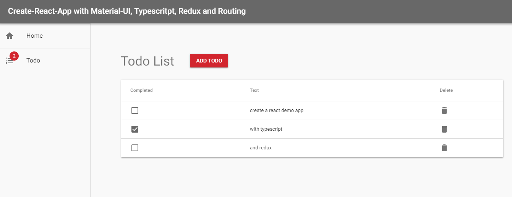

# React app playground



## How to use

Install it and run:

```bash
npm i
npm start
```

## TODO:

- Add Firebase Authentication https://www.robinwieruch.de/complete-firebase-authentication-react-tutorial#react-router-for-firebase-auth
- ADD Firebase Database https://www.robinwieruch.de/complete-firebase-authentication-react-tutorial#firebase-realtime-database-in-react
- Firebase redux https://blog.bitsrc.io/building-a-todo-app-in-react-with-firebase-and-redux-ba3ab53a671b

## Enable PWA ServiceWorker [OPTIONAL]

Just comment in the following line in the `index.tsx`:

```javascript
// registerServiceWorker();
```

to

```javascript
registerServiceWorker();
```

## Enable Prettier [OPTIONAL]

1.  Step: Install the Prettier plugin (e.g. the one of Esben Petersen)
2.  Add the following snippet to your settings in VSCode:

```json
    "editor.formatOnSave": true,
    "editor.codeActionsOnSave": {
       "source.organizeImports": true // optional
   },
```
